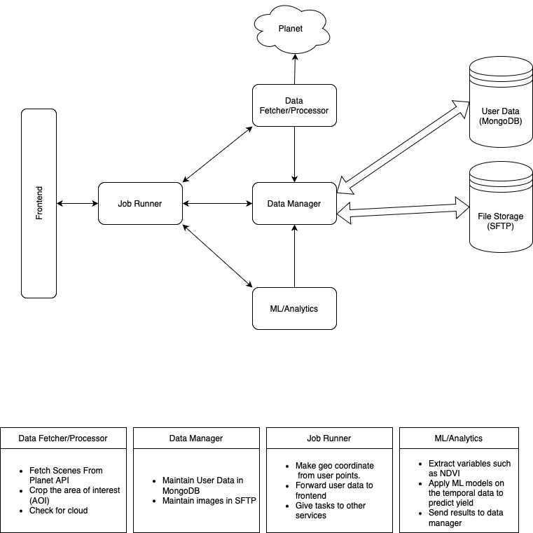

# Satellite-Based Crop Monitoring System (SCMS)

SCMS is a powerful web-based application that enables farmers and agricultural researchers to monitor crop health and predict yields using satellite imagery. The system provides real-time insights through vegetation indices and machine learning models, helping users make informed decisions about crop management.

## System Architecture Overview

SCMS implements a modern microservices architecture where each component is containerized using Docker, enabling modular development and deployment. The system is designed with security, scalability, and maintainability in mind. The frontend communicates exclusively with the Job Runner service, which acts as an orchestrator for all backend operations. This design ensures that internal APIs remain private and secure, while the Job Runner manages authentication and coordinates tasks across other services.

### Key Architectural Benefits
- **Enhanced Security**: Internal APIs are not publicly exposed, reducing attack surfaces and ensuring data protection
- **Scalability**: Each service can be scaled independently based on demand
- **Flexibility**: Docker containerization allows deployment across various cloud platforms (AWS, Azure, GCP) with minimal modifications
- **Maintainability**: Modular design enables independent updates and improvements to services
- **Future-Proof**: New capabilities can be easily integrated by adding new containers without restructuring the existing system



## Features

- **Real-time Crop Monitoring**: Track crop health using high-resolution satellite imagery
- **Vegetation Analysis**: Automated calculation of NDVI (Normalized Difference Vegetation Index) and GCI (Green Chlorophyll Index)
- **Yield Prediction**: Advanced machine learning models for accurate crop yield forecasting
- **Disease Detection**: Early identification of potential crop diseases through heat map visualization
- **Multi-Farm Management**: Efficiently manage and monitor multiple farming areas
- **Interactive Interface**: User-friendly web interface for marking Areas of Interest (AOI) and analyzing data

## Demo

Check out our system demo:
[](https://raw.githubusercontent.com/saranshagarwal202/Satellite_based_crop_monitoring_system/main/demo.mp4)

## System Architecture

SCMS employs a microservice architecture with Docker containerization, ensuring scalability and maintainability. Each microservice is responsible for specific functionalities:

- **Frontend**: React.js based user interface
- **Job Runner**: Orchestrates backend operations and handles authentication
- **Data Fetcher/Processor**: Manages satellite imagery retrieval and preprocessing
- **Data Manager**: Handles data storage and retrieval operations
- **ML/Analytics**: Performs advanced analytics and yield predictions
- **test_PLANET_API**: Mock server for Planet API (development and testing)

## Technical Details

### Core Technologies
- Frontend: React.js
- Backend: Microservices architecture with Docker
- Database: MongoDB for metadata, SFTP for image storage
- Machine Learning: Random Forest models for yield prediction
- API: REST-based communication between services

### Performance Metrics
- Yield Prediction Model Performance on Cotton Crop:
  - MAE: 3.66
  - RMSE: 5.55
  - R² Score: 0.81

## Directory Structure

```
SCMS/
├── frontend/              # React.js frontend application
├── job_runner/           # Task orchestration service
├── data_fetcher/         # Satellite data acquisition service
├── data_manager/         # Data storage and retrieval service
├── ml_analytics/         # Machine learning and analytics service
├── test_PLANET_API/      # Mock Planet API server for testing
├── demo.mp4              # System demonstration video
├── architecture.jpeg     # System architecture diagram
└── README.md            # Project documentation
```

## Getting Started

1. Clone the repository:
```bash
git clone https://github.com/saranshagarwal202/Satellite_based_crop_monitoring_system.git
cd SCMS
```

2. Start the services using Docker Compose:
```bash
docker-compose up
```

3. Access the application at `http://localhost:3000`

## License

This project is licensed under the GNU General Public License v3.0 - see the LICENSE file for details.
